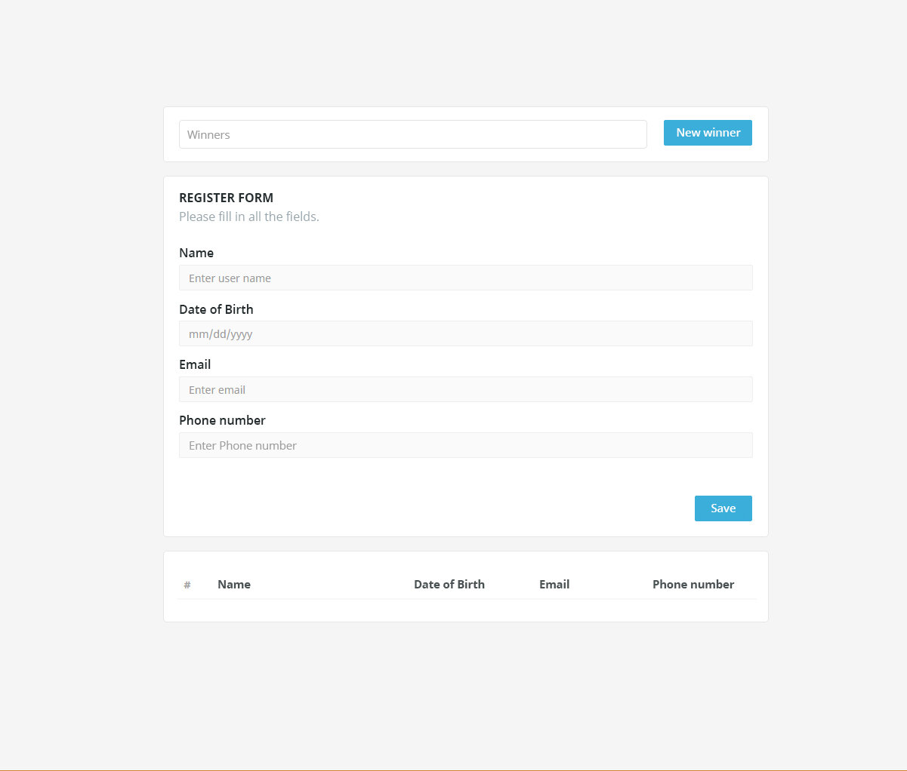
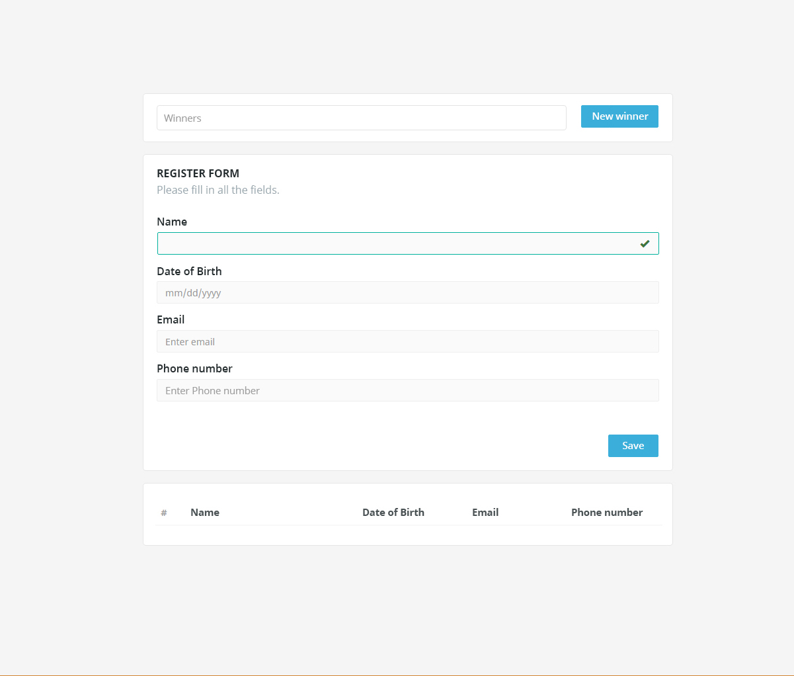
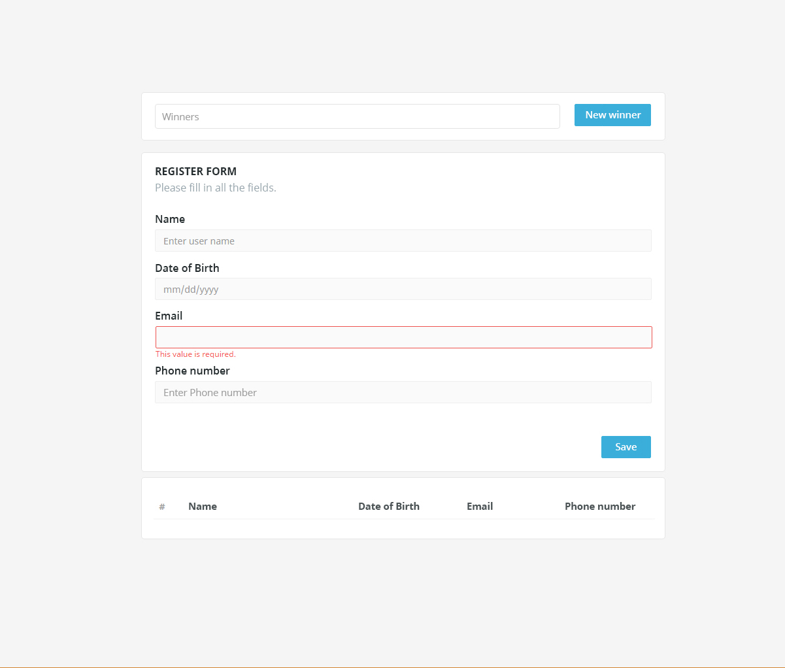
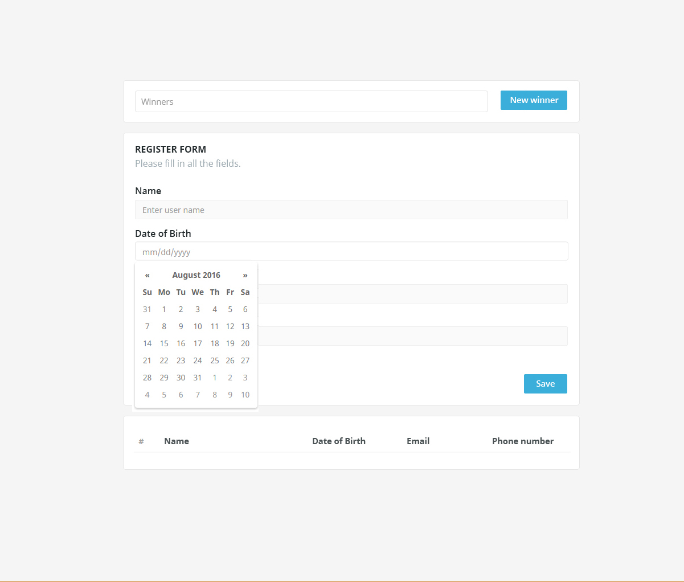
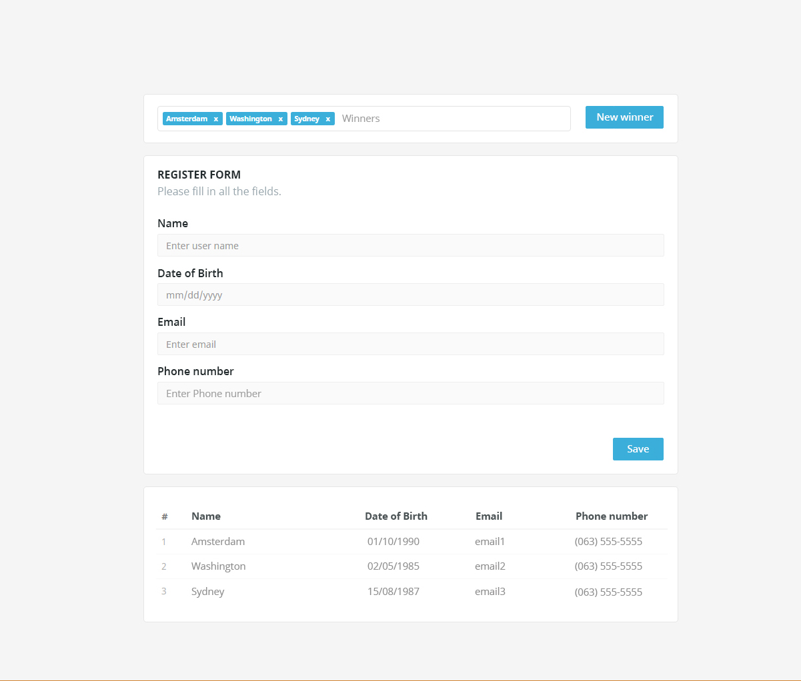

= Лабораторна робота №4

*Тема:* Основи роботи з компонентами: обчислювані властивості, обробка подій, прив'язування елементів форми, props, watchers

*Мета:* засвоїти основи роботи з компонентами у Vue.js, зокрема використання обчислюваних властивостей, обробки подій, прив'язування елементів форми, передачі даних між компонентами через props, взаємодії компонентів через події (event handling) та відстеження змін у стані застосунку за допомогою watchers.
Навчитися створювати інтерактивні багаторазові компоненти, що реагують на дії користувача, керують даними у формах, ефективно використовують реактивність та взаємодіють між собою у складі єдиного застосунку.

*Вимоги до звіту:*

. Лабораторна робота повинна бути виконана в окремому github репозиторії студента, з назвою vue-lottery-app.
. Дотримання TypeScript-типізації;
. Використання Composition Api;
. Під час написання застосунку, обов'язково дотримуватись https://ua.vuejs.org/style-guide/[style guide];
. Для стилізації використати один з css фреймворків: Bootstrap, Tailwindcss (обов'язково встановити через npm).
Імпортуйте тільки необхідні стилі (базові, кнопки, таблиці, поля тощо).
Використовуйте scss.
. Використовуйте Eslint;
. Заборонено використовувати alert для показу помилок юзеру.

== Практична частина

=== Самостійна робота студента:

. https://ua.vuejs.org/guide/typescript/overview.html[Typescript in vue];
. https://ua.vuejs.org/guide/typescript/composition-api.html[Composition Api];
. https://ua.vuejs.org/guide/essentials/computed.html[Обчислювані властивості];
. https://ua.vuejs.org/guide/essentials/event-handling.html[Обробка подій];
. https://ua.vuejs.org/guide/essentials/forms.html[Прив'язування елементів форми];
. https://ua.vuejs.org/examples/#flight-booker[Прив'язування елементів форми приклади];
. https://ua.vuejs.org/examples/#crud[Прив'язування елементів форми приклади (CRUD)];
. https://ua.vuejs.org/guide/components/props.html[Реквізити];
. https://ua.vuejs.org/guide/components/events.html[Події компонентів];
. https://ua.vuejs.org/guide/essentials/watchers.html[Спостерігачі];
. https://ua.vuejs.org/guide/components/slots.html[Слоти];
. https://ua.vuejs.org/examples/#grid[Приклад створення багаторазового компонента таблиці та його використання із зовнішніми даними.];
. https://ua.vuejs.org/examples/#modal[Модальний компонент із настроюваними слотами та переходами CSS.]

=== Завдання:

Створити застосунок лотерею та поділити його на компоненти.
Лотерея повинна містити 3 блоки:

. Блок переможців;
. Блок з формою реєстрації нових учасників;
. Блок з таблицею зі списком учасників;

==== 1. Форма реєстрації нових учасників

. Всі полями є обов'язковими.
. Також необхідно перевірити правильність введеної інформації електронної пошти та телефону за regexp.
+

. Для поля з датою використовуйте https://developer.mozilla.org/en-US/docs/Web/HTML/Element/input/date[input date], додаткова стилізація календаря не потрібна.
Формат дати yyyy-mm-dd.
Дата народження не повинна бути у майбутньому, при цьому вивести юзеру помилку.
+

. Натиснувши кнопку «Save», необхідно додати учасника до таблиці - списку учасників та очистити форму реєстрації.
При очищенні форми не повинна спрацьовувати валідація полів.
+

. Унікальність e-mail.
Перед додаванням учасника в таблицю, потрібно перевірити, чи існує вже учасник з такою ж електронною поштою.
Якщо такий учасник є, потрібно вивести повідомлення про помилку.
. Додати ключовий модифікатор для прослуховування подій клавіатури: при натисканні Enter під час роботи з формою реєстрації форма повинна відправлятися.

==== 2. Випадковий вибір переможців

Реалізувати випадковий вибір переможців, натиснувши кнопку «New winner».

. Поле переможців повинно містити не більше трьох переможців.
. Зробити кнопку «New winner» не активною, якщо переможців є 3.
. Зробити кнопку «New winner» не активною, якщо список юзерів пустий.
. Реалізувати видалення переможців з блоку.

==== 3. Розділення застосунку на компоненти

Виділити в застосунку щонайменше такі компоненти:

. Компонент кнопка;
. Компонент поля вводу;
. Компонент переможця;
. Компонент блоку списку переможців;
. Компонент блоку форми реєстрації;
. Компонент блоку таблиці з учасниками;
. Компонент Modal (модальне вікно);
. Компонент SearchBar (поле пошуку).

==== 4. Робота з учасниками у таблиці

. Зберігання юзерів.
Додати зберігання юзерів у localStorage.
Збереження повинно бути реалізоване за допомогою watcher (`watch` з опцією `deep`), а відновлення -- при завантаженні застосунку.
. Редагування учасника.
Додати в кінці таблиці ще один стовпець, де розмістити кнопку "Редагувати дані".
При кліку на кнопку повинно відкритися модальне вікно з формою (форма повинна проходити валідацію), де поля вводу повинні бути заповнені даними користувача.
Нижче повинна бути кнопка "Оновити дані", клік по якій призведе до оновлення даних учасника у таблиці та закриттю модального вікна.
Модальне вікно повинно бути в окремому компоненті Modal (css стилі можна взяти з обраної UI бібліотеки).
. Видалення учасника.
Додати в кінці таблиці ще один стовпець, де розмістити кнопку "Видалити учасника".
При кліку на кнопку повинно відкритися модальне вікно, в якому юзер має підтвердити видалення користувача: "Ви дійсно бажаєте видалити учасника "participant name", "participant email"?".
Нижче розмістити кнопки "Так" (видаляє учасника), "Ні" (просто закриває модальне вікно).
. Сортування.
У таблиці учасників додати можливість сортувати за іменем (A-Z) та датою народження.
Додати відповідні контроли з іконками, наприклад, https://icons.getbootstrap.com/icons/sort-alpha-down/[Sort alpha down], https://icons.getbootstrap.com/icons/sort-down/[Sort down], які реагуватимуть на дїї користувача.
. Фільтрація.
Додати поле для пошуку учасників за іменем.
Це поле повинно бути в окремому компоненті SearchBar, який передає подію filter-by-name до батьківського компонента, і фільтрує список у таблиці на основі введених даних.
Передачу події `filter-by-name` реалізуйте за допомогою `watch` з затримкою (debounce) 300 мс.
. Додати ключовий модифікатор для прослуховування події клавіатури Esc, щоб закрити модальне вікно.

==== 5. Уточнення щодо поведінки застосунку

. Один учасник не може бути переможцем двічі: кнопка «New winner» обирає переможця лише серед учасників, які ще не є переможцями.
Кнопка також неактивна, якщо всі учасники вже стали переможцями.
. Якщо видаляється учасник, який є переможцем, він видаляється і з блоку переможців.
. Телефон вважається правильним у форматі `+380XXXXXXXXX` (код країни та 9 цифр).
. Унікальність e-mail перевіряється без урахування регістру.
При редагуванні учасника його власний e-mail дублікатом не вважається.
. Сортування та фільтрація працюють разом: спочатку список фільтрується, потім сортується.
Повторний клік по контролу сортування змінює напрямок (за зростанням/за спаданням).
Вихідний список учасників при цьому не змінюється.
. Порядок та стиль компонентів повинні виглядати так, майже як на дизайні.

== Контрольні запитання

. Що таке обчислювані властивості (computed) у Vue.js і чим вони відрізняються від звичайних методів?
. Як працює кешування обчислюваних властивостей і коли значення перераховується?
. Чи можна змінювати значення обчислюваної властивості?
Як реалізувати writable computed?
. Які існують способи оголошення обробників подій у Vue?
Чим відрізняється inline-обробник від обробника-методу?
. Для чого призначені модифікатори подій (`.prevent`, `.stop`, `.once`) та ключові модифікатори (`.enter`, `.esc`)?
Наведіть приклади використання.
. Як працює директива `v-model` і яким синтаксичним записом (`:value` та `@input`) її можна замінити для звичайного текстового поля?
. Як використовувати `v-model` з різними елементами форми: checkbox, radio, select, textarea?
. Для чого призначені модифікатори `v-model`: `.lazy`, `.number`, `.trim`?
. Як реалізувати валідацію полів форми (обов'язкові поля, regexp для e-mail та телефону, перевірка дати) та вивести помилки користувачу без використання `alert`?
. Як очистити форму після збереження так, щоб при цьому не спрацювала валідація полів?
. Що таке props?
У якому напрямку передаються дані між батьківським і дочірнім компонентами?
. Чому не можна напряму змінювати props у дочірньому компоненті?
Як правильно поступати, якщо потрібно змінити передане значення?
. Як типізувати props за допомогою TypeScript (`defineProps` або опція `props`) і як задати значення за замовчуванням та обов'язковість?
. Як дочірній компонент повідомляє батьківському про подію?
Для чого використовується `emit` (`defineEmits`) і як типізувати події?
. Як організувати двостороннє зв'язування `v-model` на власному компоненті?
. Що таке слоти (slots)?
Чим іменовані слоти відрізняються від слота за замовчуванням і як вони допомагають створити компонент Modal?
. Що таке watchers (спостерігачі)?
Чим `watch` відрізняється від `computed` і в яких випадках доцільно використовувати кожен з них?
. Для чого призначені опції `deep` та `immediate` у `watch`?
Чим `watchEffect` відрізняється від `watch`?
. Як за допомогою watcher реалізувати збереження списку учасників у `localStorage` та відновлення його при завантаженні застосунку?
. Які принципи слід враховувати при поділі застосунку на компоненти?
Що таке багаторазовий (reusable) компонент?
. Як реалізувати сортування та фільтрацію списку учасників у таблиці за допомогою обчислюваних властивостей?
. Яка різниця між Options API та Composition API?
Які переваги надає кожен із підходів?
